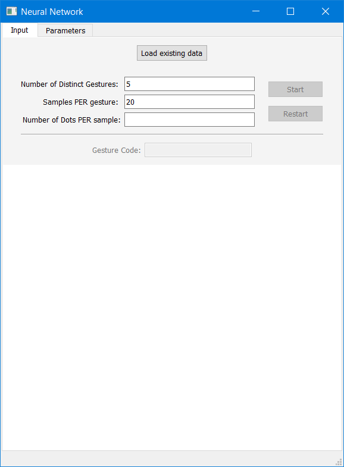
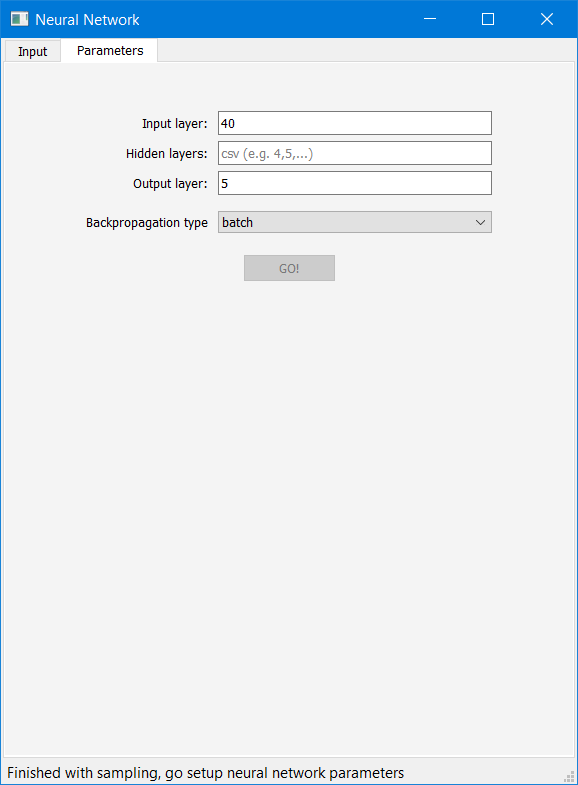
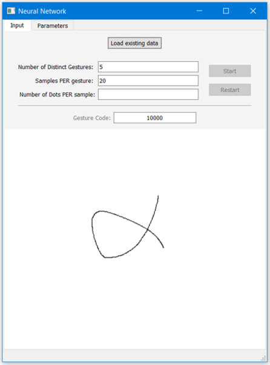

# NeuralNet_GestureClassification
### Implementation of Neural Network for gesture classification

Program takes gesture samples as input and trains neural network to classify that samples<br/>
(**e.g.** if there are total of **three** gestures, it will classify **first gesture as 100**, **second as 010** and **third as 001**

### Example
In the picutre below, intro window is shown. In white area user can define gestures.<br/>
Before doing so, few parameters are reuqired: 
- total number of gestures
- number of samples of per gesture and 
- how much dots of each sample to save <br/>



<br/>

Next picture shows window in which user defines number of hidden layers of neural network.<br/>
Size of input layer is equal to ```number of dots per sample * 2``` (x and y positions).<br/>
Size of output layer is equal to ```number of gestures```<br/>



<br/>

Picture below shows correct classification of greek leter alpha.<br/>

<br/>


### Build/Run
